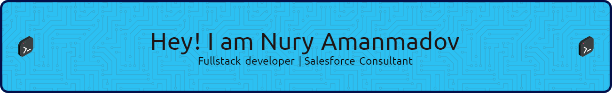

 <!-- <h1> Hi there, I'm Nury 👋 </h1> -->
 

  
  
  

 
 

 <!-- ## I'm a software engineer -->

- 💻  I have 5+ years of experience in developing <strong>Fullstack web applications</strong>
- ☁️  I have 3+ years of experience in implementing <strong>Salesforce technologies</strong>
- 🤖  For the last 2 years I have been working as an <strong>RPA</strong> software architect
- 🎓  Currently I am a graduate student of <strong>Touro University</strong> at New York
- ⚽  I am a huge <strong>FC Barcelona</strong> fan

 

## Programming Languages, Tools and Technologies:

    

    

 

## Force Platform Technologies

 

---------------------------------------------------------------------------------------------------------------
 
 

 
<!--  

 
  

    

 
-->

